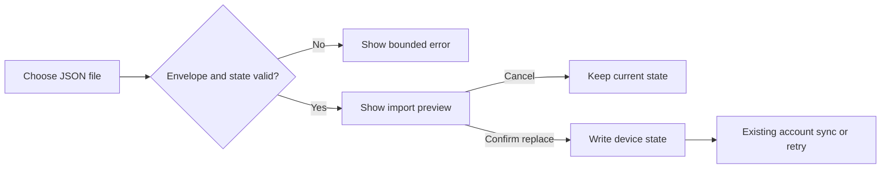

## Context

Setline stores one versioned `StoredState` in browser storage and optionally
syncs that same whole-state document to the authenticated user's private D1
record. The existing parser already validates current and legacy state shapes,
including authored programme order, record bounds, and history limits. The
application has no general settings route; secondary programme and storage
actions live in the Programme view.

The transfer flow must remain useful offline, must not export account identity,
and must not let an invalid or merely selected file mutate current workout
state.

## Goals / Non-Goals

**Goals:**

- Define a stable, versioned JSON envelope around the existing workout state.
- Reuse the authoritative stored-state parser instead of maintaining a second
  record validator.
- Bound file size and reject unknown envelope versions before parsing state.
- Show a useful preview before an explicit whole-state replacement.
- Route confirmed replacement through existing local persistence and sync
  retry behavior.
- Fit the established Programme sidebar at phone, tablet, and desktop widths.

**Non-Goals:**

- Merging two histories or active sessions.
- Importing programmes, exercises, account identity, OAuth state, or server
  metadata.
- Treating JSON import as a cloud restore or conflict override.
- Adding a server endpoint, dependency, schema migration, or deployment.

## Decisions

### Use a strict transfer envelope

Exports use:

```json
{
  "format": "setline-workout-data",
  "formatVersion": 1,
  "exportedAt": "ISO-8601 timestamp",
  "state": {}
}
```

The parser accepts only the named format, version `1`, a valid timestamp, and a
state accepted by `parseStoredState`. This separates transfer compatibility
from the internal state version and leaves room for future migrations without
guessing whether arbitrary JSON is a Setline backup.

Exporting raw localStorage was rejected because it has no product-level format
marker and would encourage users to import unrelated browser data.

### Validate before preview and mutate only on confirmation

The browser reads at most 2 MiB from one `.json` file. Invalid type, size,
syntax, envelope, timestamp, or state produces a specific error and no state
change. A valid file creates an in-memory preview containing the active workout,
history count, most recent completion, and export time.



Using `window.confirm` alone was rejected because it cannot show enough
incoming evidence and is hard to review at gym speed.

### Replace the whole device state

A confirmed import replaces the current active session and history together.
Its mutation timestamp becomes newer than the current local state so the normal
device-first persistence effect records it and queues authenticated sync.
Setline does not merge histories because duplicate identity, execution order,
and active-session conflict rules do not exist yet.

### Keep transfer controls secondary

The controls sit below Programme rules in a compact "Workout data" group.
Download and file selection use quiet secondary actions. The preview uses the
existing paper, ink, blue evidence, and coral destructive hierarchy; the
replace action is explicitly destructive. Active workout screens and primary
navigation remain unchanged.

## Risks / Trade-offs

- **A user replaces newer local history** → Preview current/incoming counts and
  require explicit replacement; cancellation has no side effect.
- **A file is valid JSON but not Setline data** → Require the strict envelope
  and authoritative state parser.
- **A large file consumes browser memory** → Reject files over 2 MiB before
  reading.
- **An authenticated import meets newer remote state** → Preserve existing
  newest-state conflict behavior; do not claim import overrides cloud truth.
- **Exports expose workout history to whoever receives the file** → State this
  beside Download and include no account or credential data.

## Migration Plan

No stored-state or database migration is required. Existing users gain the
controls after the normal application release. Removing the feature is a code
revert; exported files remain inert JSON and existing device/cloud state is
unchanged.

## Open Questions

None. Merge semantics and cloud-data deletion remain separate issue items.
