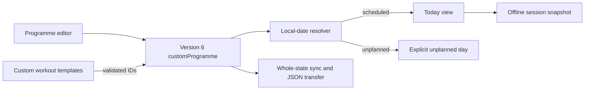

## Context

Setline now persists bounded custom workout templates in version 5 whole-state
storage and starts them through immutable session snapshots. The missing layer
is an explicit calendar that references those templates without becoming a
second source of exercise truth. Active execution must remain device-first,
and importing or synchronizing one object must preserve state integrity.

## Goals / Non-Goals

**Goals:**

- Represent one named, enabled-or-paused programme spanning 1–16 Monday-based
  weeks.
- Keep assignments as template references and resolve a local date to
  scheduled, unplanned, or out-of-range.
- Make assignment changes, week copying, destructive shrink/delete actions,
  and unsaved drafts explicit and keyboard accessible.
- Migrate version 5 state additively and include the programme in existing
  whole-state sync and backup.

**Non-Goals:**

- Multiple programme libraries, overlapping active programmes, arbitrary
  recurrence, time-zone travel reconciliation, automatic generation,
  progression decisions, reminders, or third-party import.
- Deployment, D1 migration, authentication, dependency, or production changes.

## Decisions

### Store one optional programme in version 6 state

`StoredState` gains `customProgramme: CustomProgramme | null`. A programme has
name, Monday `startsOn`, `weekCount`, `enabled`, created/updated timestamps, and
a bounded array of unique `{weekNumber, dayIndex, workoutId}` assignments.

This avoids a premature programme library and active-programme selector. A
collection plus active ID was considered, but would add lifecycle and
conflict states not required by issue #9.

### Keep schedule slots as references

Assignments contain only a custom workout ID. Editing a template therefore
affects future starts while sessions keep their existing snapshots. Explicit
template deletion removes matching assignments in the same state update.
Embedding workout snapshots in every slot was rejected because it would
silently fork workout truth and multiply transfer size.

### Resolve dates with local calendar components

The resolver converts both `startsOn` and the supplied local `Date` to UTC
midnight from their calendar components, then computes the Monday-based day
offset. This prevents daylight-saving elapsed-hour changes from shifting a
slot while retaining the user’s local calendar intent.

### Treat an empty in-range slot as unplanned

An enabled programme owns dates inside its range. Today must show an explicit
unplanned day rather than falling through to the bundled schedule. Paused or
out-of-range programmes do fall back to the bundled plan.

### Author in a bounded responsive week board

The Programme view adds a preserve-mode editor below custom templates. Each
week exposes seven labelled selects; a confirmed copy-forward action repeats
one week, and reducing a populated range or deleting the programme requires
confirmation. Phone layout stacks day rows; tablet and desktop use a denser
grid without horizontal scrolling.

## Risks / Trade-offs

- **[Long programmes create a tall form]** → cap at 16 weeks, use dense week
  sections, and keep phone controls single-column.
- **[Template deletion creates dangling references]** → clear matching
  assignments atomically and reject dangling imported state.
- **[DST shifts date arithmetic]** → compare UTC-midnight values constructed
  from local calendar parts instead of elapsed local hours.
- **[Copy/shrink actions overwrite work]** → require confirmation whenever
  populated assignments would be replaced or removed.
- **[One programme is limiting]** → keep the data model intentionally singular;
  a future issue can introduce a collection with explicit activation semantics.

## Migration Plan

1. Parse version 6 state with cross-validation between assignments and custom
   workouts.
2. Migrate valid version 5 state by adding `customProgramme: null`; older
   migrations also terminate at version 6.
3. Keep D1 and JSON envelope shapes as whole-state JSON; no database migration
   is required.
4. Rollback code can ignore the new programme only by returning to a pre-v6
   client; no production rollout is part of this change.

## Open Questions

None for this bounded issue. Multiple saved programmes and travel/time-zone
policy remain future product decisions.
