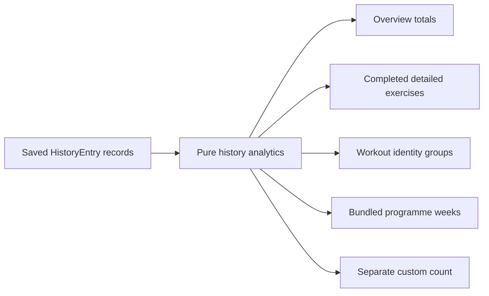

## Context

The saved `HistoryEntry` envelope already contains workout identity, authored
week, duration, summary set outcomes, working and warm-up volume, timed work,
rest, RPE, quality, and—when available—the complete execution ledger. The
current Progress page ignores that record and renders a fixed bench example.

Older migrated entries can be summary-only. Custom workouts share the same
history envelope but do not belong to the bundled 12-week programme. Missing
history proves only that no saved record is available; it does not prove that a
workout was missed.

## Goals / Non-Goals

**Goals:**

- Derive every Progress value from the existing saved record.
- Make overview, exercise, workout, and authored-week questions separately
  scannable.
- Keep recorded source values distinct from calculated aggregations.
- Preserve detailed/legacy and bundled/custom boundaries.
- Keep the page useful on a phone without a dashboard-card aesthetic.

**Non-Goals:**

- Coaching, readiness, recommendations, adherence scoring, or plan changes.
- Estimated one-repetition maximum, sensor data, health integrations, or AI.
- A state migration, cloud analytics API, export change, or deployment.

## Decisions

### Use one pure analytics boundary

Add `app/lib/history-analytics.ts` with a single deterministic derivation entry
point and small exported helpers/types. It accepts history in any order, sorts
by `completedAt`, and returns:

- overview totals;
- eligible exercise groups with lifetime values and newest-eight trend;
- workout groups keyed by `workoutId`;
- built-in week groups plus a separate custom-session count.

Keeping this pure makes edge conditions testable without React or browser
state.

### Normalize only exercise identity

Normalize exercise names by trimming, collapsing internal whitespace, and
lowercasing. Keep the newest recorded spelling as the display name. Do not
fuzzy-match aliases or merge different names because Setline lacks evidence
that they represent the same movement.

### Limit exercise detail to completed ledgers

Only `detailsAvailable` entries and completed execution records contribute
exercise values. Weight/repetition calculations use positive recorded segment
values. Lifetime working volume includes only Working executions, matching the
existing volume semantics. Summary-only records remain valid for overview,
workout, and week aggregates.

### Present one selected exercise and dense ledgers

The Progress page keeps a single native exercise select, a recent evidence
strip, one bounded bar trend, and aligned metric/ledger rows. Workout and week
summaries use dense rules rather than equal-sized dashboard cards. Empty
exercise detail explains that older summaries or non-detailed workouts cannot
support the view.

## Risks / Trade-offs

- **History contains repeated exercise spelling** → Normalize only whitespace
  and case, while displaying the newest spelling.
- **A legacy entry lacks detail** → Include its known summary values but never
  invent exercise evidence.
- **Volume can dwarf trend bars** → Trend bar height represents max recorded
  load only; repetitions remain visible text instead of combining dimensions.
- **Few records make trends sparse** → Show the exact available sessions and
  state the sample size.
- **Missing weeks look like adherence gaps** → Render only represented weeks
  and explicitly say missing history is not classified.

## Migration Plan

1. Add and test the pure analytics derivation.
2. Replace the static Progress example with preserve-lane real-history states.
3. Validate empty, detailed, legacy, custom, and long-history cases.
4. Run responsive browser review, the full project check, and strict OpenSpec.
5. Archive the change and merge the linked issue without deploying.

## Open Questions

- None. The existing history envelope and issue boundaries define the
  supported evidence.
