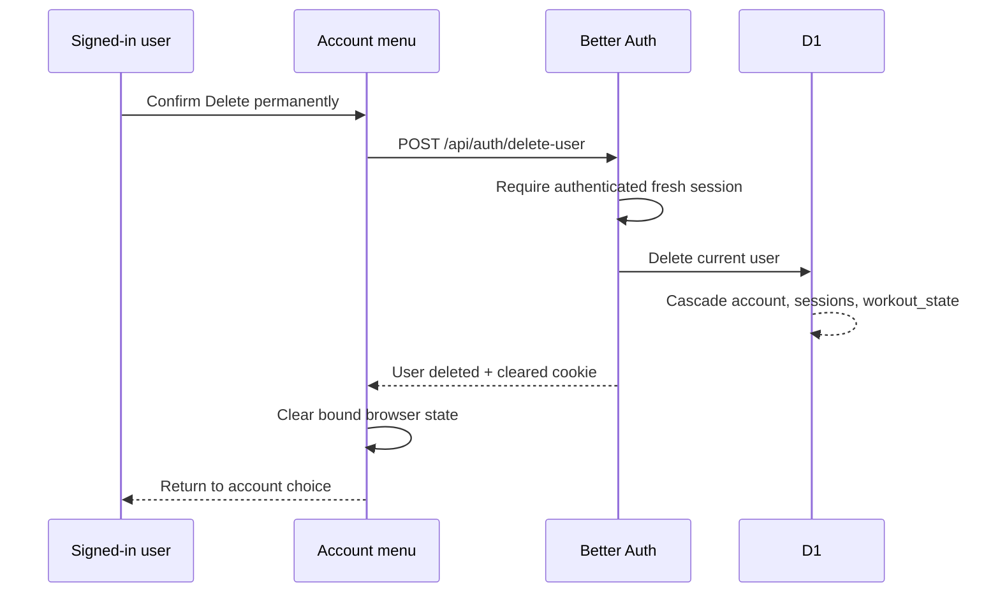

## Context

Setline already uses Better Auth for Google sessions, one `workout_state` row
per user, and device-first state in `localStorage`. The D1 migration defines
`ON DELETE CASCADE` from `user` to `session`, `account`, and `workout_state`.
Better Auth 1.6.25 includes a disabled-by-default `/delete-user` endpoint that
requires an authenticated sensitive session and checks session freshness when
no password or verification token is supplied.

The current account menu already shows identity, sync status, retry, and sign
out. The new control must stay secondary to workout execution and must not
erase the browser copy when the network or server cannot prove the account was
deleted.

## Goals / Non-Goals

**Goals:**

- Let a signed-in user permanently delete their current Setline account.
- Reuse Better Auth's security boundary instead of adding a custom delete API.
- Remove all user-scoped D1 records through the existing database cascades.
- Require clear, keyboard-usable confirmation before the request.
- Clear account-bound browser state only after confirmed success.
- Preserve Setline's existing account-menu visual language.

**Non-Goals:**

- Email-based deletion verification or password-account support.
- Google-side OAuth grant revocation.
- Recovery, soft deletion, retention windows, or operator tooling.
- Any D1 migration, production data operation, or deployment.

## Decisions

### Enable Better Auth's built-in deletion route

Set `user.deleteUser.enabled` in the existing per-request Better Auth
configuration and call `POST /api/auth/delete-user`. Better Auth applies the
authenticated sensitive-session middleware, performs its freshness check,
deletes the current user through the configured adapter, clears the session
cookie, and returns a structured result.

A custom `/api/app/account` route was rejected because it would duplicate
session security and cookie handling already owned by Better Auth.

### Keep deletion atomic at the ownership root

Delete only the authenticated `user` row. Existing foreign-key cascades remove
the linked OAuth account, all sessions, and the private workout-state row. No
schema or migration changes are necessary.

### Use an in-menu confirmation panel

Add a visually restrained destructive action beneath sign out. Activating it
reveals concise consequences plus Cancel and Delete permanently controls. The
destructive action remains coral, never lime, and the confirmation stays
inside the account menu so it does not compete with workout completion.

### Clear local data only after confirmed success

The client helper returns only after a successful Better Auth response. The
page then attempts non-throwing cleanup of the workout envelope, pending-sync
marker, cached identity, device-only preference, and state-account binding;
resets sync refs; and returns to anonymous account choice. Any rejected or
unreachable request keeps all those values unchanged. If confirmed remote
deletion succeeds but browser storage cannot be cleared, the success receipt
states that split outcome and tells the user to clear site data.

## Risks / Trade-offs

- **A stale session rejects a legitimate request** → Keep all data intact and
  explain that the user should sign in again before retrying.
- **Network loss makes the result uncertain** → Better Auth's response is the
  only client cleanup signal; a missing response never erases local state and
  the message says only that deletion was not confirmed.
- **Google may retain the OAuth grant** → State clearly that Setline account
  deletion is not Google grant revocation; revocation remains out of scope.
- **The database cascade could drift** → Add focused source-level verification
  around the migration and auth configuration, alongside the full project
  check.

## Migration Plan

1. Enable the existing Better Auth route and add client deletion handling.
2. Add the preserve-lane confirmation states and update privacy copy.
3. Validate source contracts, client behavior, responsive UI, and OpenSpec.
4. Merge through a linked pull request. Production deployment remains a
   separate manual action.

## Open Questions

- None. The bounded issue and existing ownership model define the behavior.
